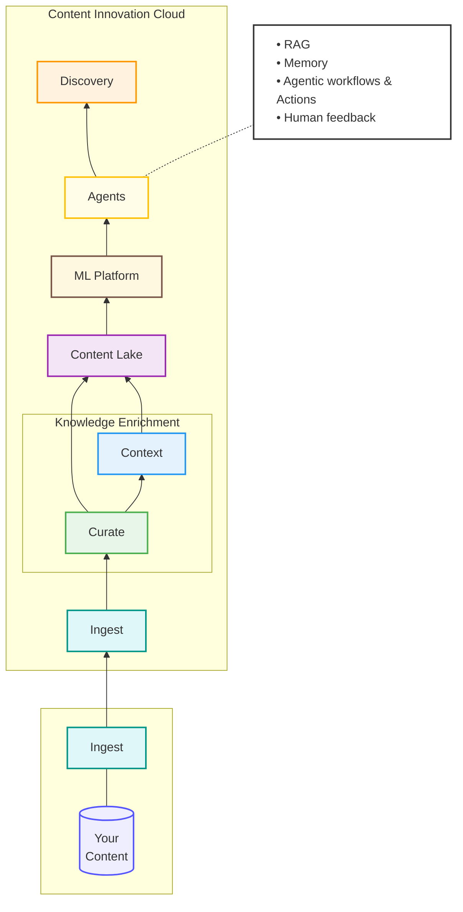

The Agent subsystem provides the foundation for building AI agents:

-
a framework to express agent behavior

-
a framework to create agentic workflow

-
APIs for agent creation using blueprints

-
an Agent Builer Studio experience

Supported agent types include:

-
Retrieval-Augmented Generation (RAG)

-
ReAct / Tool-based agents

-
Multi-modal agents
