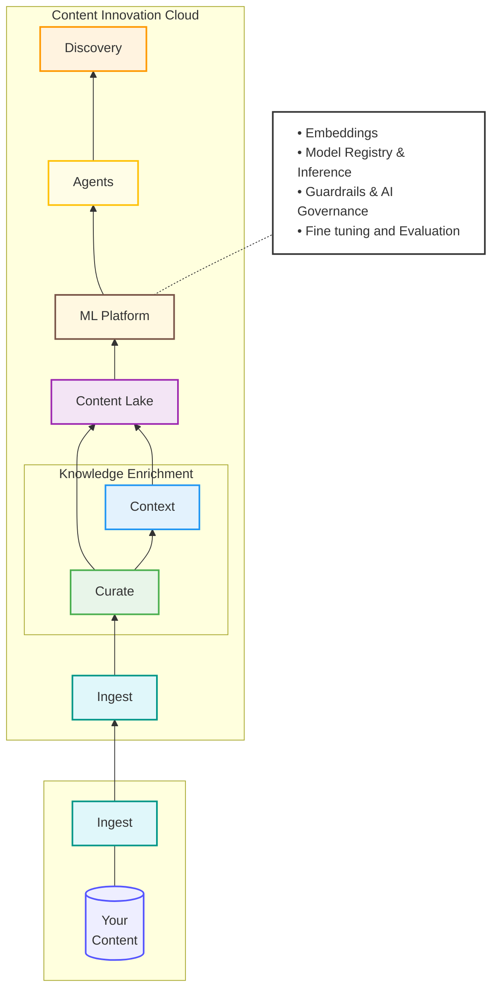

The Machine Learning (ML) Platform is the engine that powers all Content Intelligence capabilities. It provides the inference infrastructure, model management, and governance frameworks required to transform enterprise content into structured intelligence.

## Platform Capabilities

The ML Platform serves as a centralized service used by Data Curation, Context Enrichment, and Agent infrastructure.

### Inference & Model Catalog
The platform provides access to a wide range of models tailored for different business needs:
- **Foundation Models (LLMs)**: High-performance language models via Amazon Bedrock.
- **Predictive AI**: Specialized models for classification and numerical forecasting.
- **Embeddings**: Models that convert text and images into vector form for semantic search.

---

## AI-Enabling Enterprise Content

AI models operate on numerical vectors. To make your documents "AI-ready," the platform performs two critical steps:
1. **Semantic Breaking**: Large documents are broken down into meaningful units (paragraphs, tables, illustrations).
2. **Vector Encoding**: Each unit is passed through an embedding model to create a high-dimensional vector that represents its meaning.

---

## Content Qualification & Extraction

AI significantly improves the quality and consistency of document metadata without manual effort.

- **Auto-Categorization**: Automatically identifying document classes (e.g., distinguishing an invoice from a contract).
- **Intelligent Extraction**: Pulling named entities (people, organizations, dates) and relationships directly from the text.
- **Auto-Summarization**: Generating concise descriptions and summaries for large volumes of content.

---

## IDP & Workflow Automation

Content Intelligence integrates agents directly into business processes via **Intelligent Document Processing (IDP)** and **Automate**.

- **Recognition & Categorization**: IDP uses AI to recognize document structures and categorize them within a batch.
- **Assist & Automate**: Agents provide decision support within workflows, helping users process documents faster or automating routing decisions based on extracted data.

---

## Governance & Quality Control

To ensure the safety and reliability of AI outputs, the platform includes:
- **Guardrails**: Automated checks to prevent hallucinations and ensure adherence to security principles.
- **Model Registry**: Centralized tracking of all models in use, including versioning and performance metrics.
- **Fine-Tuning**: Capabilities to further train models on your specific business data for increased accuracy.
