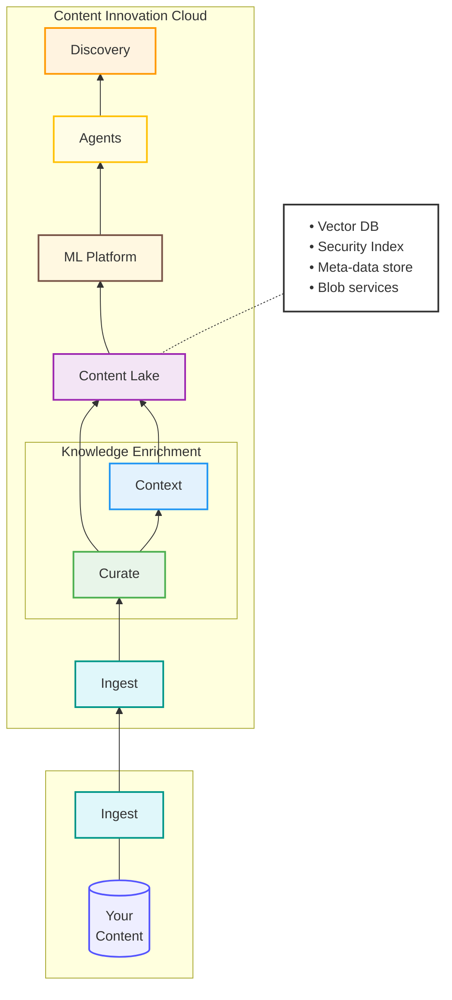

The Content Intelligence data platform is a multi-stage pipeline designed to ingest unstructured data from various sources, transform it into AI-ready formats, and store it in a secure, semantically-indexed "Content Lake."

## The Intelligent Data Pipeline

Data flows through several enrichment stages before it is accessible to Knowledge Discovery agents or autonomous systems.

---

## 1. Data Ingestion

Ingestion provides the gateway for content to enter the CIC environment. The platform exposes a single **Ingest API**, supported by client-side connectors for repositories like OnBase, Alfresco, and SharePoint.

- **On-Demand or Continuous**: Content can be ingested in bulk batches or via continuous synchronization.
- **Full Fidelity**: Ingestion captures raw blobs (files), associated system/custom metadata, and security descriptors (ACLs).

---

## 2. Data Curation & Enrichment

Before content is indexed, the **Knowledge Enrichment (KE)** layer transforms raw data into structured, searchable intelligence.

- **Format Conversion**: Standardizing files (e.g., converting legacy formats to web-ready JPEG or PDF).
- **Text Extraction**: Using tools like **DocumentFilter** and **AWS Textract** to pull text from Office docs, PDFs, and even audio/image files.
- **Semantic Chunking**: Splitting large documents into smaller, semantically meaningful "chunks" while preserving context and Markdown structure.
- **Embedding Generation**: Converting text chunks into high-dimensional vectors for semantic search.

---

## 3. The Content Lake (HXPR)

The **Content Lake** is the central repository for all curated and enriched content. Built on Hyland's cloud-native repository (**HXPR**), it provides:

- **Hybrid Storage**: Combined storage for raw blobs and structured metadata.
- **Vector Database**: Optimized indexing of embeddings to support lightning-fast semantic queries.
- **Security Enforcement**: A dedicated Security Index ensures that AI agents only access content the user is authorized to see.

## 4. Semantic Indexing

Unlike traditional keyword search, CIC uses **Semantic Indexing** to understand the *meaning* behind content. Users can find information based on topic relevance or sentence similarity, enabling far more accurate results for complex business queries.
