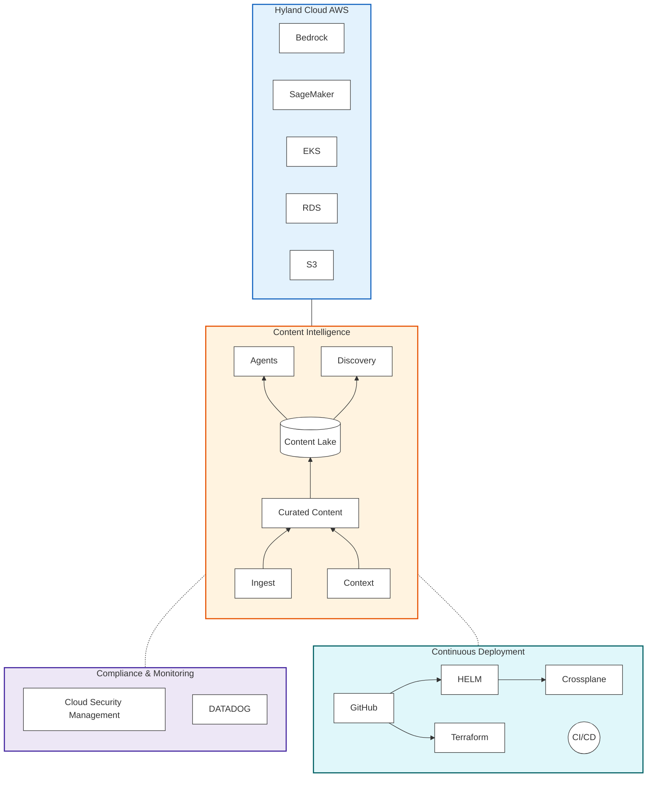

Hyland Cloud offers a secure, scalable, and compliant environment for deploying SaaS services.

Here's a visual representation of how Content Intelligence fits with Hyland Cloud.

```mermaid
flowchart TD
    subgraph HylandCloud [Hyland Cloud AWS]
        direction LR
        Bedrock[Bedrock]
        SageMaker[SageMaker]
        EKS[EKS]
        RDS[RDS]
        S3[S3]
    end

    subgraph CI [Content Intelligence]
        direction BT
        Ingest[Ingest]
        Context[Context]
        CuratedContent[Curated Content]
        ContentLake[(Content Lake)]
        Agents[Agents]
        Discovery[Discovery]
        
        Ingest --> CuratedContent
        Context --> CuratedContent
        CuratedContent --> ContentLake
        ContentLake --> Agents
        ContentLake --> Discovery
    end

    subgraph CM [Compliance & Monitoring]
        direction TB
        CSM[Cloud Security Management]
        Datadog[DATADOG]
    end

    subgraph CD [Continuous Deployment]
        direction LR
        GitHub[GitHub] --> Helm[HELM]
        GitHub --> Terraform[Terraform]
        Helm --> Crossplane[Crossplane]
        CICD((CI/CD))
    end

    HylandCloud --- CI
    CI -.- CM
    CI -.- CD

    classDef default fill:#fff,stroke:#333,stroke-width:1px;
    classDef aws fill:#e3f2fd,stroke:#1565c0,stroke-width:2px;
    classDef ci fill:#fff3e0,stroke:#e65100,stroke-width:2px;
    classDef cm fill:#ede7f6,stroke:#4527a0,stroke-width:2px;
    classDef cd fill:#e0f7fa,stroke:#006064,stroke-width:2px;
    class HylandCloud aws;
    class CI ci;
    class CM cm;
    class CD cd;
```
