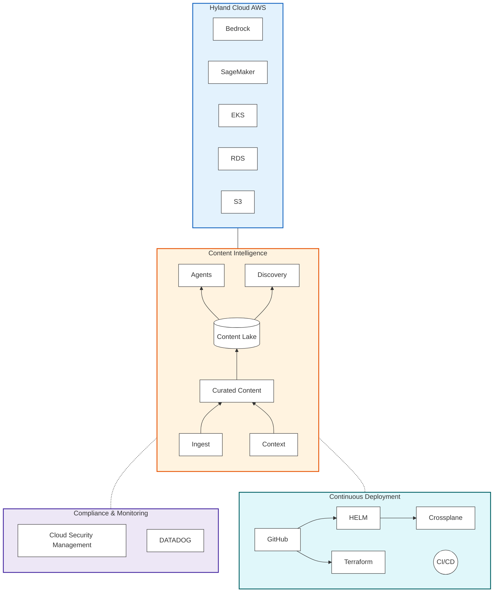
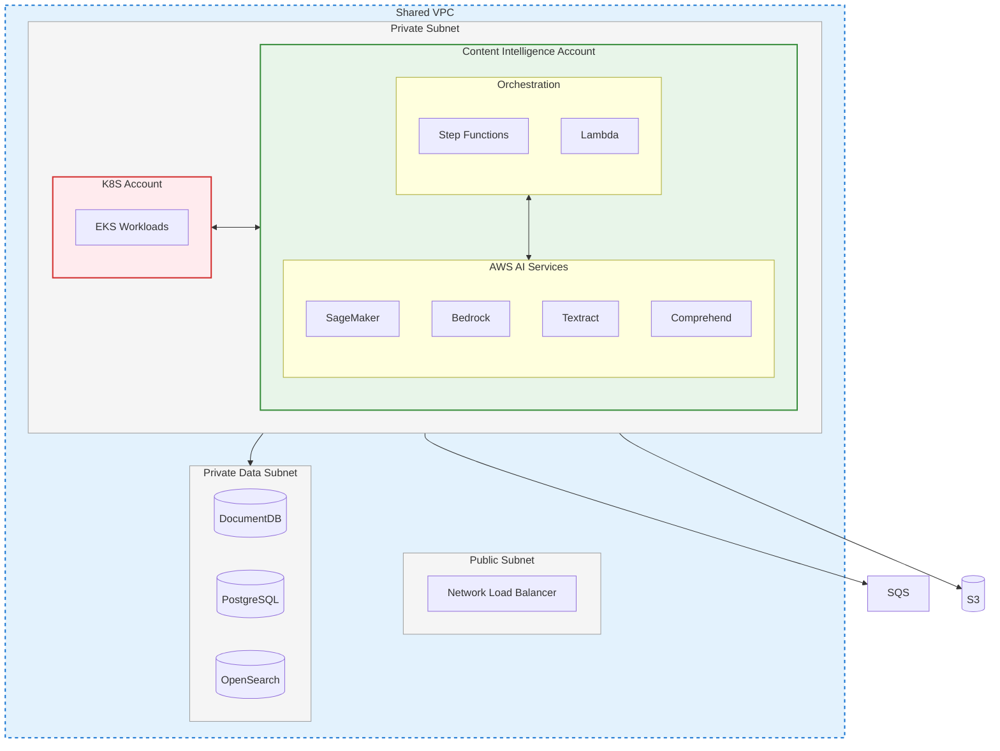

Content Intelligence is primarily deployed within the **Hyland Cloud AWS** environment, leveraging a robust suite of managed services to ensure high availability, security, and performance.

## Architectural Integration

The following diagram illustrates how Content Intelligence services integrate with Hyland Cloud infrastructure and monitoring components.

---

## Hybrid & Cloud-Agnostic Design

While Hyland Cloud is the default delivery environment, Content Intelligence is built using **cloud-agnostic standards** to support hybrid and multi-cloud deployments.

- **Kubernetes Standardization**: All services are containerized and deployed via managed Kubernetes clusters (AWS EKS, Azure AKS, GCP GKE, or Red Hat OpenShift).
- **Control Plane**: Scaling and control plane operations are K8s-native, ensuring portability across different infrastructure providers.

---

## Network & Account Isolation

Data security is maintained through rigorous isolation at both the account and network levels.

- **VPC Segregation**: Workloads and storage are isolated within a private Virtual Private Cloud (VPC).
- **IAM & IDP**: Identity and Access Management (IAM) roles and identity propagation are handled via the central Hyland Cloud Identity Provider.
- **Account Isolation**: Strategic workloads are distributed across multiple AWS accounts to minimize the blast radius of any potential security events.

### Kubernetes & AWS Service Interaction

The diagram below details the interaction between the Kubernetes workload cluster and supporting AWS AI and data services.

---

## Multi-Tenant Provisioning

Every CIC subscription triggers the automated provisioning of a dedicated tenant environment, ensuring data sovereignty and resource availability:

- **Dedicated Database Instances**: No shared database tables between different customers.
- **S3 Bucket Isolation**: Unique bucket prefixes or dedicated buckets for object storage.
- **Separate Messaging Queues**: Dedicated SQS queues for processing requests and events.
