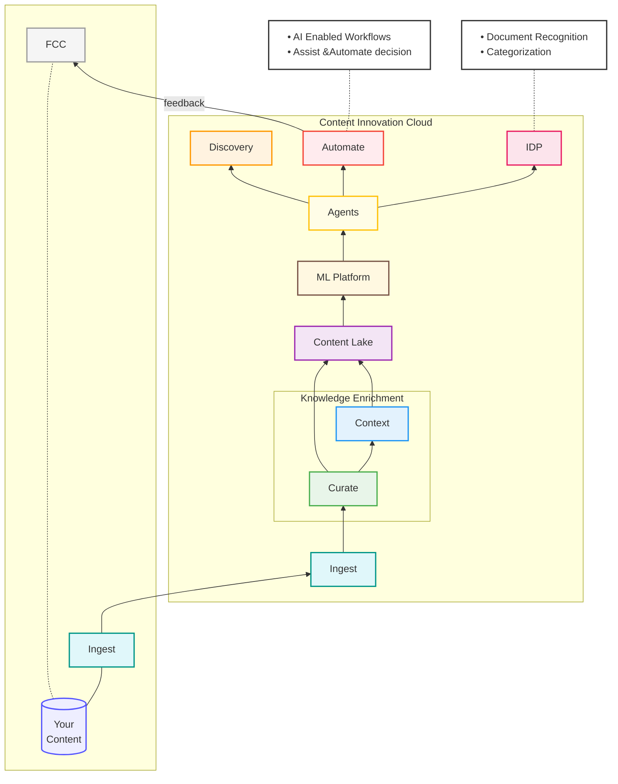

```mermaid
flowchart BT
    subgraph UserSpace [ ]
        direction LR
        YC[(Your<br>Content)] --- Ingest1[Ingest]
        FCC[FCC]
        YC -.- FCC
    end

    subgraph CIC [Content Innovation Cloud]
        direction BT
        Ingest2[Ingest]
        
        subgraph KE [Knowledge Enrichment]
            direction LR
            Curate[Curate] --> Context[Context]
        end
        
        ContentLake[Content Lake]
        ML[ML Platform]
        Agents[Agents]
        Discovery[Discovery]
        Automate[Automate]
        IDP[IDP]
        
        Ingest2 --> Curate
        Curate --> ContentLake
        Context --> ContentLake
        ContentLake --> ML
        ML --> Agents
        Agents --> Discovery
        Agents --> Automate
        Agents --> IDP
    end

    Ingest1 --> Ingest2
    Automate -->|feedback| FCC

    %% Feature Boxes
    F1["• AI Enabled Workflows<br>• Assist &Automate decision"]
    F2["• Document Recognition<br>• Categorization"]
    Automate -.- F1
    IDP -.- F2
    
    %% Styles
    classDef default fill:#fff,stroke:#333,stroke-width:1px;
    classDef db fill:#eef,stroke:#55f,stroke-width:2px;
    classDef ingest fill:#e0f7fa,stroke:#009688,stroke-width:2px;
    classDef curate fill:#e8f5e9,stroke:#4caf50,stroke-width:2px;
    classDef context fill:#e3f2fd,stroke:#2196f3,stroke-width:2px;
    classDef lake fill:#f3e5f5,stroke:#9c27b0,stroke-width:2px;
    classDef ml fill:#fff8e1,stroke:#795548,stroke-width:2px;
    classDef agents fill:#fffde7,stroke:#ffc107,stroke-width:2px;
    classDef discovery fill:#fff3e0,stroke:#ff9800,stroke-width:2px;
    classDef automate fill:#ffebee,stroke:#f44336,stroke-width:2px;
    classDef idp fill:#fce4ec,stroke:#e91e63,stroke-width:2px;
    classDef fcc fill:#f5f5f5,stroke:#9e9e9e,stroke-width:2px;
    classDef features fill:#fff,stroke:#333,stroke-width:2px,text-align:left;

    class YC db;
    class Ingest1,Ingest2 ingest;
    class Curate curate;
    class Context context;
    class ContentLake lake;
    class ML ml;
    class Agents agents;
    class Discovery discovery;
    class Automate automate;
    class IDP idp;
    class FCC fcc;
    class F1,F2 features;
```
The Intelligent Document Processing (IDP) and Automate components integrate agents into workflows for process automation.
