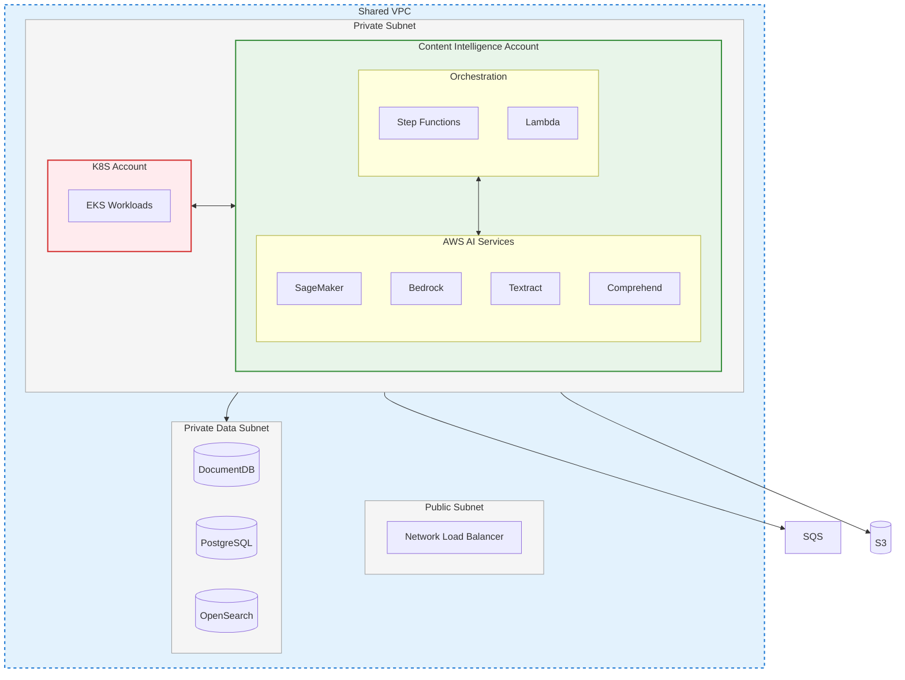

Business workload are deployed in managed Kubernetes clusters for scalability, efficiency, and portability.

Here's how Kubernetes processes work with Content Intelligence.

```mermaid
flowchart TD
    subgraph VPC [Shared VPC]
        subgraph Public [Public Subnet]
            NLB[Network Load Balancer]
        end

        subgraph Private [Private Subnet]
            direction LR
            subgraph K8SAccount [K8S Account]
                EKS[EKS Workloads]
            end
            
            subgraph CIAccount [Content Intelligence Account]
                direction TB
                subgraph Orchestration [Orchestration]
                    StepFunctions[Step Functions]
                    Lambda[Lambda]
                end
                
                subgraph Services [AWS AI Services]
                    SageMaker[SageMaker]
                    Bedrock[Bedrock]
                    Textract[Textract]
                    Comprehend[Comprehend]
                end
                
                Orchestration <--> Services
            end
            
            K8SAccount <--> CIAccount
        end

        subgraph PrivateData [Private Data Subnet]
            direction LR
            DocDB[(DocumentDB)]
            PGSQL[(PostgreSQL)]
            OpenSearch[(OpenSearch)]
        end
    end
    
    Private --> PrivateData
    
    SQS[SQS]
    S3_Storage[(S3)]
    
    Private --> SQS
    Private --> S3_Storage

    classDef vpc fill:#e3f2fd,stroke:#1976d2,stroke-width:2px,stroke-dasharray: 5 5;
    classDef subnet fill:#f5f5f5,stroke:#9e9e9e,stroke-width:1px;
    classDef k8s fill:#ffebee,stroke:#d32f2f,stroke-width:2px;
    classDef ci fill:#e8f5e9,stroke:#388e3c,stroke-width:2px;
    
    class VPC vpc;
    class Public,Private,PrivateData subnet;
    class K8SAccount k8s;
    class CIAccount ci;
```
