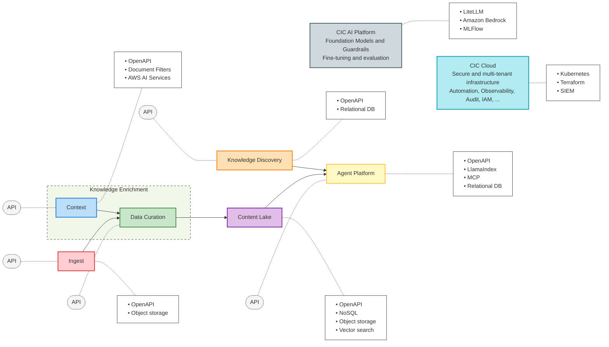

Every Content Intelligence component is modular and exposes its own API.

```mermaid
flowchart LR
    subgraph CIC [ ]
        direction LR
        Ingest[Ingest]
        
        subgraph KE [Knowledge Enrichment]
            direction BT
            Context[Context]
            DataCuration[Data Curation]
            Context --> DataCuration
        end
        
        ContentLake[Content Lake]
        
        subgraph Delivery [ ]
            direction BT
            KnowledgeDiscovery[Knowledge Discovery]
            AgentPlatform[Agent Platform]
            KnowledgeDiscovery --> AgentPlatform
        end
        
        Ingest --> DataCuration
        DataCuration --> ContentLake
        ContentLake --> AgentPlatform
    end
    
    %% API Tags
    IngestAPI([API]) -.- Ingest
    DCAPI([API]) -.- DataCuration
    ContextAPI([API]) -.- Context
    AgentAPI([API]) -.- AgentPlatform
    KDAPI([API]) -.- KnowledgeDiscovery

    %% Feature Lists
    F_Ingest["• OpenAPI<br>• Object storage"]
    F_Context["• OpenAPI<br>• Document Filters<br>• AWS AI Services"]
    F_Lake["• OpenAPI<br>• NoSQL<br>• Object storage<br>• Vector search"]
    F_Agent["• OpenAPI<br>• LlamaIndex<br>• MCP<br>• Relational DB"]
    F_KD["• OpenAPI<br>• Relational DB"]
    
    Ingest -.- F_Ingest
    Context -.- F_Context
    ContentLake -.- F_Lake
    AgentPlatform -.- F_Agent
    KnowledgeDiscovery -.- F_KD

    %% Infrastructure
    AIPlatform["CIC AI Platform<br>Foundation Models and Guardrails<br>Fine-tuning and evaluation"]
    CICCloud["CIC Cloud<br>Secure and multi-tenant infrastructure<br>Automation, Observability, Audit, IAM, ..."]
    
    CIC ~~~ AIPlatform
    AIPlatform ~~~ CICCloud
    
    F_AI["• LiteLLM<br>• Amazon Bedrock<br>• MLFlow"]
    AIPlatform -.- F_AI
    
    F_Cloud["• Kubernetes<br>• Terraform<br>• SIEM"]
    CICCloud -.- F_Cloud

    classDef ingest fill:#ffcdd2,stroke:#d32f2f,stroke-width:2px;
    classDef curate fill:#c8e6c9,stroke:#388e3c,stroke-width:2px;
    classDef context fill:#bbdefb,stroke:#1976d2,stroke-width:2px;
    classDef lake fill:#e1bee7,stroke:#7b1fa2,stroke-width:2px;
    classDef agent fill:#fff9c4,stroke:#fbc02d,stroke-width:2px;
    classDef kd fill:#ffe0b2,stroke:#f57c00,stroke-width:2px;
    classDef api fill:#f5f5f5,stroke:#9e9e9e,stroke-width:1px,border-radius:15px;
    classDef features fill:#fff,stroke:#333,stroke-width:1px,text-align:left;
    classDef infra fill:#cfd8dc,stroke:#455a64,stroke-width:2px;
    classDef cloud fill:#b2ebf2,stroke:#0097a7,stroke-width:2px;

    class Ingest ingest;
    class DataCuration curate;
    class Context context;
    class ContentLake lake;
    class AgentPlatform agent;
    class KnowledgeDiscovery kd;
    class IngestAPI,DCAPI,ContextAPI,AgentAPI,KDAPI api;
    class AIPlatform infra;
    class CICCloud cloud;
    class F_Ingest,F_Context,F_Lake,F_Agent,F_KD,F_AI,F_Cloud features;
    
    style CIC fill:none,stroke:none;
    style Delivery fill:none,stroke:none;
    style KE fill:#f1f8e9,stroke:#333,stroke-dasharray: 5 5;
```
This allows selective adoption and agile development.
