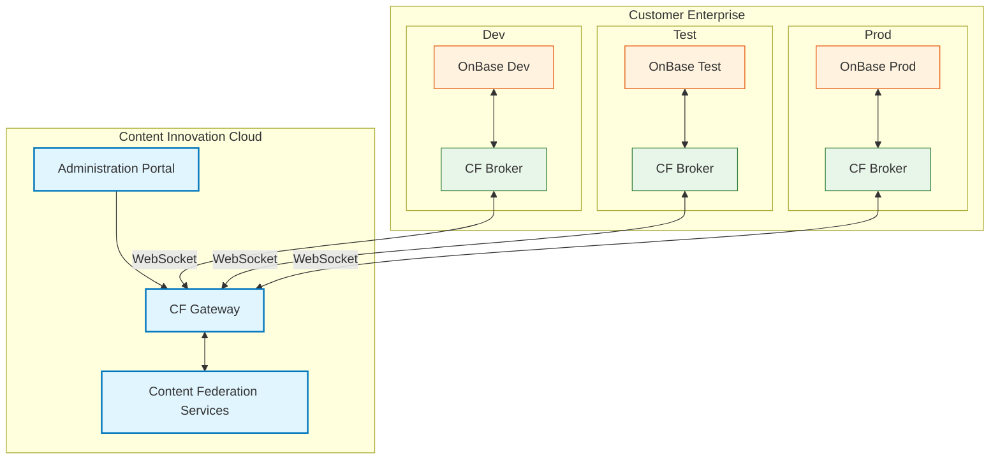

## Available Actions

When configuring the Content Federated connector, the action is used to define what the connector does.

For information on how connector terms relate to OnBase-specific terms, see OnBase Terms and CFS Terms.

The following actions are available to the Content Federated connector:

-  GET_CONTENT_PARTS
-  SEARCH_CONTENTS
-  CREATE_CONTENT
-  READ_FIELDS
-  READ_CONTENTTYPE_GROUP
-  GET_RENDITION
-  GET_OBJECT_QUERIES
-  EXECUTE_OBJECT_QUERY
-  GET_CONTENT_PART_PROPERTIES
-  READ_CONTENTTYPE_GROUPS
-  GET_OBJECT_QUERY_DETAILS
-  READ_CONTENTTYPE_DEFINITION
-  READ_CONTENT_BINARY

## GET_CONTENT_PARTS

Minimum Compatible Version: CFS V3

The GET_CONTENT_PARTS action returns a presigned URL or streamed binary for parts of a given piece of content. This can be useful for viewing the parts or for downstream processing.

The input parameters of the action are:

| Parameter | Type | Required | Description |
| --- | --- | --- | --- |
| contentId | String | Required | The ID of the content part to retrieve properties for |
| logicalPartIds | Array | Required | The IDs of the logical parts to retrieve |
| task | String | Optional | Identifier of the previous task, whose data is fetched if the authorization was done on behalf of that task |

The output parameters of the action are:

| Parameter | Type | Required | Description |
| --- | --- | --- | --- |
| result | JSON | Optional | A response from the system with a list of available content parts and their properties.The contents of the result may be used as data for the input parameters of another action. |

## SEARCH_CONTENTS

Minimum Compatible Version: CFS V2

The SEARCH_CONTENTS action allows for performing searches within the content source, helping to locate content based on specific criteria, such as metadata, content type, or keywords.

Note: Access to hidden keywords is determined by the permissions of the user running this action. Ensure that users assigned to run this action have the necessary Access Restricted Keywords privilege if they require access to hidden keyword entries.
The input parameters of the action are:

| Parameter | Type | Required | Description | Default Value |
| --- | --- | --- | --- | --- |
| offset | String | Optional | Page offset for pagination. | 0 |
| pageSize | String | Optional | Page size for the content. | 100 |
| searchContent | JSON | Required | Parameters of the content to be searched. You can use the pencil button next to this field to display the Edit variable mapping dialog box. In the Value tab, you can define the search parameters for the action to limit the search results. | N/A |
| task | String | Optional | Identifier of the previous task, whose data is fetched if the authorization was done on behalf of that task. | N/A |

The output parameters of the action are:

| Parameter | Type | Required | Description |
| --- | --- | --- | --- |
| result | JSON | Optional | A response from the system.The contents of the result may be used as data for the input parameters of another action. |

## CREATE_CONTENT

Minimum Compatible Version: CFS V2

The CREATE_CONTENT action creates new content (such as documents or records) in the content source system. It uploads and stores the content along with its associated metadata.

The input parameters of the action are:

| Parameter | Type | Required | Description |
| --- | --- | --- | --- |
| content | JSON | Required | Content that will be created. |
| task | String | Optional | Identifier of the previous task, whose data is fetched if the authorization was done on behalf of that task. |

The output parameters of the action are:

| Parameter | Type | Required | Description |
| --- | --- | --- | --- |
| result | JSON | Optional | A response from the system.The contents of the result may be used as data for the input parameters of another action. |

## READ_FIELDS

Minimum Compatible Version: CFS V2

The READ_FIELDS action retrieves the metadata or fields associated with a content item. It provides descriptive data, such as keywords, tags, or other attributes related to the content.

Note: Access to hidden keywords is determined by the permissions of the user running this action. Ensure that users assigned to run this action have the necessary Access Restricted Keywords privilege if they require access to hidden keyword entries.
The input parameters of the action are:

| Parameter | Type | Required | Description |
| --- | --- | --- | --- |
| contentId | String | Required | Identifier of the content whose metadata will be read. |
| task | String | Optional | Identifier of the previous task, whose data is fetched if the authorization was done on behalf of that task. |

The output parameters of the action are:

| Parameter | Type | Required | Description |
| --- | --- | --- | --- |
| result | JSON | Optional | A response from the system.The contents of the result may be used as data for the input parameters of another action. |

## READ_CONTENTTYPE_GROUP

Minimum Compatible Version: CFS V2

The READ_CONTENTTYPE_GROUP action reads data from a single Content Type Group, including all of its Content Types.

The input parameters of the action are:

| Parameter | Type | Required | Description |
| --- | --- | --- | --- |
| contentTypeGroupId | String | Required | Identifier of the group type whose content type will be read. |
| task | String | Optional | Identifier of the previous task, whose data is fetched if the authorization was done on behalf of that task. |

The output parameters of the action are:

| Parameter | Type | Required | Description |
| --- | --- | --- | --- |
| result | JSON | Optional | A response from the system.The contents of the result may be used as data for the input parameters of another action. |

## GET_RENDITION

Minimum Compatible Version: CFS V3

The GET_RENDITION action fetches all available PDF renditions of a content item.

The input parameters of the action are:

| Parameter | Type | Required | Description |
| --- | --- | --- | --- |
| contentId | String | Required | Identifier of the content that will be read |
| mimeType | String | Required | MIME type of the content that will be readThe only accepted value for this parameter is application/pdf. |
| task | String | Optional | Identifier of the previous task, whose data is fetched if the authorization was done on behalf of that task |

The output parameters of the action are:

| Parameter | Type | Required | Description |
| --- | --- | --- | --- |
| response | JSON | Optional | A response from the system. It contains the MIME type, and file validation metadata.The contents of the result may be used as data for the input parameters of another action. |

## GET_OBJECT_QUERIES

Minimum Compatible Version: CFS V2

The GET_OBJECT_QUERIES action returns a list of available search queries within the system. These queries are used to search through structured data (like patient data) and help users populate keyword values for content.

This action can be connected further with the GET_OBJECT_QUERY_DETAILS and then EXECUTE_OBJECT_QUERY actions to execute a query with parameters set.

The input parameters of the action are:

| Parameter | Type | Required | Description |
| --- | --- | --- | --- |
| offset | String | Optional | Page offset for pagination. |
| pageSize | String | Optional | Page size for the content. |
| task | String | Optional | Identifier of the previous task, whose data is fetched if the authorization was done on behalf of that task. |

The output parameters of the action are:

| Parameter | Type | Required | Description |
| --- | --- | --- | --- |
| result | JSON | Optional | A response from the system.The contents of the result may be used as data for the input parameters of another action. |

## EXECUTE_OBJECT_QUERY

Minimum Compatible Version: CFS V2

The EXECUTE_OBJECT_QUERY action allows users to submit specific search criteria and execute a query. It returns results that match the given search fields, such as data objects or records. For example, if the user is searching patient data, this action would return matching records based on the provided search parameters.

The input parameters of the action are:

| Parameter | Type | Required | Description |
| --- | --- | --- | --- |
| content | JSON | Required | Object query fields. Use the pencil button to open the Edit variable mapping dialog box, where you can add the query fields for the lookup in the Value tab. |
| offset | String | Optional | Page offset for pagination. |
| pageSize | String | Optional | Page size for the content. |
| queryId | String | Required | Identifier of the query that will be executed. |
| task | String | Optional | Identifier of the previous task, whose data is fetched if the authorization was done on behalf of that task. |

The output parameters of the action are:

| Parameter | Type | Required | Description |
| --- | --- | --- | --- |
| result | JSON | Optional | A response from the system.The contents of the result may be used as data for the input parameters of another action. |

## GET_CONTENT_PART_PROPERTIES

Minimum Compatible Version: CFS V3

The GET_CONTENT_PART_PROPERTIES action returns a list of metadata for a given content part. The returned list includes the MIME type, size, and page count. This may be useful for breaking down large TIFFs or multi-part documents. It may also be useful for flows that rely on knowing the input structure of content parts.

The input parameters of the action are:

| Parameter | Type | Required | Description |
| --- | --- | --- | --- |
| contentId | String | Required | The ID of the content part to retrieve properties for |
| offset | String | Optional | Page offset for pagination |
| pageSize | String | Optional | Page size for the content |
| task | String | Optional | Identifier of the previous task, whose data is fetched if the authorization was done on behalf of that task |

The output parameters of the action are:

| Parameter | Type | Required | Description |
| --- | --- | --- | --- |
| result | JSON | Optional | A response from the system with a list of available content parts and their properties.The contents of the result may be used as data for the input parameters of another action. |

## READ_CONTENTTYPE_GROUPS

Minimum Compatible Version: CFS V2

The READ_CONTENTTYPE_GROUPS action is used to read data from all existing Content Type Groups, but it is limited only to their identifiers and names.

The input parameters of the action are:

| Parameter | Type | Required | Description | Default Value |
| --- | --- | --- | --- | --- |
| offset | String | Optional | Page offset for pagination. | N/A |
| operation | String | Optional | Type of the operation. | "Search" |
| pageSize | String | Optional | Page size for the content. | N/A |
| task | String | Optional | Identifier of the previous task, whose data is fetched if the authorization was done on behalf of that task. | N/A |

The output parameters of the action are:

| Parameter | Type | Required | Description |
| --- | --- | --- | --- |
| result | JSON | Optional | A response from the system.The contents of the result may be used as data for the input parameters of another action. |

## GET_OBJECT_QUERY_DETAILS

Minimum Compatible Version: CFS V2

The GET_OBJECT_QUERY_DETAILS action provides detailed information about a specific search query. It includes all the fields (think of them as columns in a table) that can be used in the query.

This can be used with EXECUTE_OBJECT_QUERY to execute a lookup with defined search parameters.

Note: Access to hidden keywords is determined by the permissions of the user running this action. Ensure that users assigned to run this action have the necessary Access Restricted Keywords privilege if they require access to hidden keyword entries.
The input parameters of the action are:

| Parameter | Type | Required | Description |
| --- | --- | --- | --- |
| queryId | String | Required | Identifier of the query whose details will be read. |
| task | String | Optional | Identifier of the previous task, whose data is fetched if the authorization was done on behalf of that task. |

The output parameters of the action are:

| Parameter | Type | Required | Description |
| --- | --- | --- | --- |
| result | JSON | Optional | A response from the system.The contents of the result may be used as data for the input parameters of another action. |

## READ_CONTENTTYPE_DEFINITION

Minimum Compatible Version: CFS V2

The READ_CONTENTTYPE_DEFINITION action is used to read the definition of a Content Type that was configured in another system.

The input parameters of the action are:

| Parameter | Type | Required | Description | Default Value |
| --- | --- | --- | --- | --- |
| contentTypeId | String | Required | Identifier of a content type that will be read. | N/A |
| operation | String | Optional | Type of operation. | "Search" |
| task | String | Optional | Identifier of the previous task, whose data is fetched if the authorization was done on behalf of that task. | N/A |

The output parameters of the action are:

| Parameter | Type | Required | Description |
| --- | --- | --- | --- |
| result | JSON | Optional | A response from the system.The contents of the result may be used as data for the input parameters of another action. |

## READ_CONTENT_BINARY

CAUTION: This action is deprecated and is set to be removed. Please use the GET_RENDITION action instead.
Minimum Compatible Version: CFS V2

The READ_CONTENT_BINARY action fetches the binary data of a content item, allowing access to the raw file or content itself (such as images, PDFs, and audio files).

The input parameters of the action are:

| Parameter | Type | Required | Description |
| --- | --- | --- | --- |
| contentId | String | Required | Identifier of the content that will be read. |
| mimeType | String | Required | MIME type of the content that will be read. |
| task | String | Optional | Identifier of the previous task, whose data is fetched if the authorization was done on behalf of that task. |

The output parameters of the action are:

| Parameter | Type | Required | Description |
| --- | --- | --- | --- |
| result | JSON | Optional | A response from the system.The contents of the result may be used as data for the input parameters of another action. |

## Cf Broker To Cf Plugin Compatibility Matrix

The following table describes compatibility between versions of the CF Broker and versions of the CF Plugin. This helps to ensure that your version of the CF Broker is compatible with the CF Plugin intended for your content and data source.

| CF Broker Version | OnBase Plugin Versions | Federated Identity Plugin Versions | Nuxeo Plugin Versions | Alfresco Plugin Versions | Supported in Windows | Supported in Linux |
| --- | --- | --- | --- | --- | --- | --- |
| 1.0 | 1.0 | N/A | N/A | N/A | Yes | No |
| 1.1 | 1.1 | N/A | N/A | N/A | Yes | No |
| 2.0 | 2.0 | 1.0 | N/A | N/A | Yes | No |
| 2.1 | 2.1 | 1.0 | N/A | N/A | Yes | No |
| 3.0 (Latest) | 3.0 (Latest) | 1.1 (Latest) | 1.0 (Latest) | 1.0 (Latest) | Yes | CFS Broker OCI Image and all CF Plugins are supported. |

## Compatible Content And Data Source Systems

Ensure that your content and data source is compatible with the Content Federation Services (CFS) application.

The following table lists data source software compatible with CFS:

| Software | Version |
| --- | --- |
| OnBase | Foundation 24.1 or later |
| SharePoint | Microsoft 365 |
| Alfresco | Enterprise: 25.2.0 | Community: 25.2.0 |
| Nuxeo | LTS 2025.12 |

## SharePoint Integration Limitations

The Content Federation Services (CFS) integration for SharePoint only supports service-to-service authentication flows. SharePoint does not support delegated authentication flows.

For these reasons, it is recommended that you use the CFS integration for SharePoint only in scenarios where service-level access is sufficient and user impersonation is not required.

When using the CFS integration for SharePoint, note the following:

- The configured client application (represented by the clientId and clientSecret) is used to authenticate against Microsoft Graph APIs.
- The CFS integration for SharePoint does not operate on behalf of the user who initiated the request. Instead, it uses the identity of the configured application. As a result, any user-specific context or permissions tied to the requesting user are not available during the execution of SharePoint-related operations.
- Audit entries generated from SharePoint operations are correlated to the service account context, not the individual user who initiated the request.

## Content Federated Connectors

The Content Federation Services (CFS) application uses Content Federated connectors to translate and integrate data from your content repository to the Content Innovation Cloud (CIC).

The following topics describe concepts and steps for configuring and using Content Federated connectors:

-  Methods of User Configuration
-  Configuring a Content Federated Connector
-  Deploying Content Federated Connectors
-  Starting a Process with the Content Federated Connector

## Content Federation Admin Portal

The Content Federation Admin Portal is the site for administrators to perform tasks related to managing their deployment of the Content Federation Services (CFS) application. The Content Federation Admin Portal is available through the Content Innovation Cloud (CIC) User Portal.

Note: Users do not create their own accounts for the Content Federation Admin Portal. An account is created and credentials are sent to new users as part of onboarding when first signing up for a CFS subscription.
The following topics detail the functions available in the Content Federation Admin Portal:

-  Content Federation Connection Manager
-  Content Federation Registered Brokers
-  Token Management
-  User Mapping

## Content Federation Connection Manager

The Content Federation Services (CFS) application uses the Content Federation Connection Manager to check the status of current connections and add new connections. The Content Federation Connection Manager is part of the Content Federation Admin Portal.

The following topics describe how to perform actions in the Content Federation Connection Manager:

-  Checking CFS Connections
-  Adding a New CFS Connection

## Content Federation Registered Brokers

The Content Federation Services (CFS) application allows users to check the status of registered brokers and delete brokers on the Content Federation Registered Brokers page. The Content Federation Registered Brokers page is part of the Content Federation Admin Portal.

The following topics describe how to perform actions on the Content Federation Registered Brokers page:

-  Checking Registered Brokers
-  Deleting Registered Brokers

## Coordinating The Cf Broker And Cf Fi Plugin

After the CF Broker and CF FI Plugin have been installed and configured, the CF FI Plugin information needs to be added to the CF Broker configuration settings so that the CF Broker and CF FI Plugin can communicate.

To coordinate the CF Broker and CF FI Plugin:

1.  Navigate to the CF Broker folder. By default, the folder is located in C:\Program Files\Hyland.
2.  Open the appsettings.json file in a plain-text editor, such as Notepad.
3.  Under Plugins, set values for the following parameters:
| Plugins Parameter | Value |
| --- | --- |
| PluginId | The ID of the CF FI Plugin. Enter e2a1c7b2-3b7e-4c2a-9b1a-2f6e8c7d9a1b |
| PluginPath | The absolute/complete file path to the DLL file that corresponds to the CF FI Plugin installation. For example, C:/Program Files/Hyland/Hyland Content Federation Federated Identity Plugin/Hyland.ContentFederation.Plugin.FederatedIdentity.Scim.dll |
| PluginConfigPath | The absolute/complete file path to the plugin configuration file. For example, C:/Program Files/Hyland/Hyland Content Federation Federated Identity Plugin/PluginConfig/PluginConfig.json |

4.  Save and close the appsettings.json file.

## Deleting Registered Brokers

You may delete any registered CF Brokers that are no longer being used by going to the Content Federation Registered Brokers page in the Content Federation Admin Portal.

To delete a registered broker:

1.  Log in to the Content Innovation Cloud User Portal. For more information on how to log in to the Content Innovation Cloud User Portal, see Sign-in Options in the Content Innovation Cloud Administration Portal documentation.
2.  Ensure the appropriate environment is selected.
3.  Under Applications, click Content Federation Admin Portal. The Content Federation Connection Manager page is displayed.
4.  Click the Broker Management tab. The Content Federation Registered Brokers page is displayed.
5.  Click the Actions button (![Actions button](data:image/gif;base64,R0lGODlhDQAZAHcAACH5BAAAAAAALAAAAAANABkAh////0dFUUdLbUdRmWRLUZFRUZHJ8cv5/O3Jmfn50Pn5/AAAAAAAAAAAAAAAAAAAAAAAAAAAAAAAAAAAAAAAAAAAAAAAAAAAAAAAAAAAAAAAAAAAAAAAAAAAAAAAAAAAAAAAAAAAAAAAAAAAAAAAAAAAAAAAAAAAAAAAAAAAAAAAAAAAAAAAAAAAAAAAAAAAAAAAAAAAAAAAAAAAAAAAAAAAAAAAAAAAAAAAAAAAAAAAAAAAAAAAAAAAAAAAAAAAAAAAAAAAAAAAAAAAAAAAAAAAAAAAAAAAAAAAAAAAAAAAAAAAAAAAAAAAAAAAAAAAAAAAAAAAAAAAAAAAAAAAAAAAAAAAAAAAAAAAAAAAAAAAAAAAAAAAAAAAAAAAAAAAAAAAAAAAAAAAAAAAAAAAAAAAAAAAAAAAAAAAAAAAAAAAAAAAAAAAAAAAAAAAAAAAAAAAAAAAAAAAAAAAAAAAAAAAAAAAAAAAAAAAAAAAAAAAAAAAAAAAAAAAAAAAAAAAAAAAAAAAAAAAAAAAAAAAAAAAAAAAAAAAAAAAAAAAAAAAAAAAAAAAAAAAAAAAAAAAAAAAAAAAAAAAAAAAAAAAAAAAAAAAAAAAAAAAAAAAAAAAAAAAAAAAAAAAAAAAAAAAAAAAAAAAAAAAAAAAAAAAAAAAAAAAAAAAAAAAAAAAAAAAAAAAAAAAAAAAAAAAAAAAAAAAAAAAAAAAAAAAAAAAAAAAAAAAAAAAAAAAAAAAAAAAAAAAAAAAAAAAAAAAAAAAAAAAAAAAAAAAAAAAAAAAAAAAAAAAAAAAAAAAAAAAAAAAAAAAAAAAAAAAAAAAAAAAAAAAAAAAAAAAAAAAAAAAAAAAAAAAAAAAAAAAAAAAAAAAAAAAAAAAAAAAAAAAAAAAAAAAAAAAAAAAAAAAAAAAAAAAAAAAAAAAAAAAAAAAAAAAAAAAAAAAAAAAAAAAAAAAAAAAAAAAAAAAAAAAAAAAAAAAAAAAAAAAAAAAAAAAAAAAAAAAAAAAAAAAAAAAAAAAAAhHABUIHEiwoMGDCBMqXEgQAQEBBhAmKBAgwIADBydWvIjQIUSGIBV6jJiRokWMBjWe7PiQZMiXDVtKNMkxJU2UBkfC3MmzYEAAOw==)) next to the broker you would like to delete.
6.  Select Delete Broker. The Delete Broker dialog box is displayed.
7.  Click Delete. The selected broker is deleted and removed from the list on the Content Federation Registered Brokers page.

## Documentation Notice

The information and software described in this document are furnished only under a separate agreement and may only be used or copied according to the terms of such agreement. It is against the law to copy the software except as specifically allowed in such agreement. Complying with all applicable copyright laws is the responsibility of the user. Without limiting the rights under copyright law, no part of this document may be reproduced, stored in or introduced into a retrieval system, or transmitted in any form or by any means (electronic, mechanical, photocopying, recording, or otherwise), or for any purpose, without the express written permission of Hyland Software, Inc. and/or one of its affiliates.

Hyland, OnBase, Alfresco, Nuxeo, Content Innovation Cloud, and other product or brand names are registered and/or unregistered trademarks of Hyland Software, Inc. and its affiliates in the United States and other countries. All other trademarks, service marks, trade names and products of other companies are the property of their respective owners.

© 2026 Hyland.

The information in this document may contain technology as defined by the Export Administration Regulations (EAR) and could be subject to the Export Control Laws of the U.S. Government including for the EAR and trade and economic sanctions maintained by the Office of Foreign Assets Control as well as the export controls laws of your entity’s local jurisdiction. Transfer of such technology by any means to a foreign person, whether in the United States or abroad, could require export licensing or other approval from the U.S. Government and the export authority of your entity’s jurisdiction. You are responsible for ensuring that you have any required approvals prior to export.

DISCLAIMER: This documentation contains available instructions for a specific Hyland product or module. This documentation is not specific to a particular customer or industry. All data, names, and formats used in this document’s examples are fictitious unless noted otherwise. This document may reference websites operated by third parties. In such a case, Hyland has no control or liability for the content of such third-party websites. The inclusion of such a link shall not constitute an endorsement or affiliation with such a third-party website; the reference is provided for information purposes only. If you have questions about discrepancies in this document, please contact Hyland. Hyland customers are responsible for making their own independent assessment of the information in this documentation. This documentation: (a) is for informational purposes only, (b) is subject to change without notice, (c) is confidential information of Hyland Software, Inc. and its affiliates, and (d) does not create any commitments or assurances by Hyland. This documentation is provided “as is” without representation or warranty of any kind. Hyland expressly disclaims all implied, express, or statutory warranties. Hyland’s responsibilities and liabilities to its customers are controlled by the applicable Hyland agreement. This documentation does not modify any agreement between Hyland and its customers.

**Document Name**
Content Federation Services
**Department/Group**
Documentation
**Revision Number**
Current

## Localization

The Content Federation Admin Portal is available in English, French, German, Spanish, Italian, Polish, and Portuguese, allowing administrators to navigate and manage the portal in their preferred language.

The language can be changed from the Settings menu ( ![Settings menu](data:image/gif;base64,R0lGODlhJQAmAHcAACH5BAEAAAAALAAAAAAlACYAh/8A/wAAAAEBAQICAgMDAwQEBAUFBQYGBgcHBwgICAkJCQoKCgsLCwwMDA0NDQ4ODg8PDxAQEBERERISEhMTExQUFBUVFRYWFhcXFxgYGBkZGRoaGhsbGxwcHB0dHR4eHh8fHyAgICEhISIiIiMjIyQkJCUlJSYmJicnJygoKCkpKSoqKisrKywsLC0tLS4uLi8vLzAwMDExMTIyMjMzMzQ0NDU1NTY2Njc3Nzg4ODs7Ozw8PD09PT4+Pj8/P0FBQUNDQ0REREVFRUhISElJSUxMTE1NTU5OTk9PT1BQUFFRUVNTU1dXV1paWltbW15eXl9fX2BgYGFhYWJiYmNjY2VlZWZmZmdnZ2hoaGpqamxsbG1tbW5ubm9vb3BwcHFxcXJycnl5eXp6ent7e35+fn9/f4CAgIODg4SEhIWFhYaGhoeHh4iIiImJiYqKioyMjI2NjY6Ojo+Pj5CQkJGRkZKSkpOTk5WVlZiYmJmZmZqampubm56enp+fn6CgoKGhoaOjo6SkpKWlpaampqenp6ioqKqqqqurq6ysrK2tra6urq+vr7CwsLGxsbKysrOzs7W1tba2tri4uLq6ury8vL29vb+/v8DAwMHBwcLCwsPDw8XFxcbGxsfHx8nJycrKysvLy8zMzM7Ozs/Pz9DQ0NHR0dLS0tTU1NXV1dbW1tfX19jY2NnZ2dvb29zc3N3d3d/f3+Dg4OHh4eTk5Ofn5+np6erq6uvr6+zs7O3t7e7u7u/v7/Dw8PHx8fLy8vPz8/T09PX19fb29vf39/j4+Pn5+fr6+vv7+/z8/P39/f7+/v///wAAAAAAAAAAAAAAAAAAAAAAAAAAAAAAAAAAAAAAAAAAAAAAAAAAAAAAAAAAAAAAAAAAAAAAAAAAAAAAAAAAAAAAAAAAAAAAAAAAAAAAAAAAAAAAAAAAAAAAAAAAAAAAAAAAAAAAAAAAAAAAAAAAAAAAAAAAAAAAAAAAAAAAAAAAAAAAAAAAAAAAAAAAAAAAAAAAAAAAAAAAAAAAAAj+AAMIHEiwoMGDCAUuW8iwocOHECEqjEixosQAFjNmnKix40OOHkMuAymyI8mSGzFmtGXJzhw5dPh4Cqbx5MNjl5yYEBFixAwsr5ClpKhsoa84Bw5sAGHhAAJKNJcVjWhzWTJjC2OJSYBi0CY1Igb4qSXV2NSPKh1+IjPESp0qJiAUMfWrkY8AL8CgiQLEzquLD3GhQXEAgwwOFXwEyrXMlZwWDkaoqECgBqFeaB9CChJBBQ4SMZzswXVsGbFWcZS4UEGjhIIqnjIzTBZsyoYZaQyN0XMq2TBduHgVWzaqTps+YTSYaDPMIUhgmFg0qEK62LFkwkjhcTOIlVVjxob+zcqRYIko52mX7RJEggGT8wtR0yABAgWRQLqMZqKBQIgk9A0NU4oRF5TAhS3H6OKHDAW0cMMIEOygCTDGkLLEBR100QqADClzDCBCOMDCKMGUooUCJ5yhhxYgEDCHLL84YkADTUwiVEMnKcOGCCVQ0kskSVAABSzLWGKEAFmMkssgAnhwyFkM5dgGj5P8iAQFUsSyzCVHIDkKLoEI8AEiUC4EkjLGwGGDAi2UIowqYCjlhRpOWEAAHrPEaEACRCBSGo7pAaPJDxTIkMYuyPiCiA8FjLDCBhQcEYowx6iShQcYVFEKhwvtYkgJDDiBCkOy+IFEDjPwQMUjmC3zSyf+NSAwRCWcLiMMKDc84MQqt8Qyiy/CnCJIHo24sgwvs8xCCyk0PPBEKrVKpUUHKoCRRxNgTJKMMtxymwwjXXhBBxYUrGBHmSdxYsQCGIAwAQY0cNEKMcv4ookTLWCAwQdNgTFqtMv0YkcNCoRABAwVpLAGLcR9UYEEOOiQQQFBPBIVoBChgscWajDSRg8OBAEKLoTYIEASd/xBxhWFzAIYRMncOEsZCYzwBiFebEAAIvmhWWaU6UUEzBwGECSAAprQa5FA3TbtNDKebNFCCiiowIMZs2zr9NZMb721LqMskkgiikiyyjBecx1A2my3nXbXbsfdtkDJ1G333XjnrbcI3gn17TdCAQEAOw==)). The default language is English (US).

## Payload Size Limit

**Issue:**
Communication with the content repository fails, and the following message is displayed in the error logs:

414: Payload Too Large
**Solution:**
This error occurs when you exceed the size limit for a WebSocket payload.

For metadata, the WebSocket payload size cannot exceed 128 KB. If this payload size limit is reached, consider lowering the amount of metadata values associated with each file.

For binary files, the size cannot exceed 5 GB. Files larger than 5 GB are not currently supported in CFS.

## Registering An Application For The Cf Broker

The Content Federation Services (CFS) application integrates with the Content Innovation Cloud as an external application. For OnBase, in order to integrate with the Content Innovation Cloud, the CF Broker needs to be registered in the Content Innovation Cloud Administration Portal.

Registering the CFS in the Content Innovation Cloud Administration Portal requires the following actions to be taken:

-  Creating Service Users for the CF Broker Note: Each CF Broker instance needs its own associated service user.
-  Creating a CF Broker User Group
-  Assigning User Roles to CF Broker User Groups
-  Registering the CF Broker in the Content Innovation Cloud Note: Each CF Broker instance needs its own external application.

## Registering The Cf Broker In The Content Innovation Cloud

The Content Federation Services (CFS) application integrates with the Content Innovation Cloud (CIC) as an external application. To communicate with the CIC, the registered application for CF Broker requires the environment_authorization scope to be allowed.

To register an external application for use by the CF Broker:

1.  Log in to the Content Innovation Cloud Administration Portal.
2.  Select the External Systems tab under the banner.
3.  In the sidebar, click External Applications. The External Applications page is displayed.
4.  Click Create External Application. The Create External Application wizard is displayed.
5.  Select Service Application as the application profile.
6.  Click Next Step. The Application Name page is displayed.
7.  In the Application Name field, enter a name for the application, such as FC-CFS Broker.
8.  Click Next Step. The User Mapping page is displayed.
9.  From the Mapped Service User drop-down list, select the service user to map to the CFS application. For more information on creating service users for the CF Broker, see Creating Service Users for the CF Broker.
10.  Click Next Step. The Allowed Scopes page is displayed.
11.  Select environment_authorization. The Environment drop-down menu is displayed.
12.  From the Environment drop-down menu, select the environment that CFS should be restricted to. The Application drop-down menu is displayed.
13.  From the Application drop-down menu, select Content Federation Brokers.
14.  Click Next Step. The Review page is displayed.
15.  Review the settings for the CFS application. To return to a previous step, do one of the following:
- Select the page containing the previous step from the left pane of the wizard.
- Click Previous Step until you reach the step you need to review.
16.  Click Create External Application. The CFS application is registered, and the Summary page displays the autogenerated application ID and client secret for the external application.
17.  Copy the Application ID and Secret values to a secure location.  CFS requires these values to obtain access tokens from the Content Innovation Cloud. Specifically, these values are used for the ClientId and ClientSecret parameters in the appsettings.json file for the CF Broker. For more information, see Configuring the CF Broker.Note: The Secret value isn't shown again after the Create External Application wizard is closed. If necessary, you can reset the secret as described in Resetting the Secret for an External Application in the Content Innovation Cloud Administration Portal documentation.

## Starting A Process With The Content Federated Connector

After a project with the Content Federated connector is deployed, processes that are part of the project are available for users to run in the Hyland Workspace.

The steps in this topic only cover processes specific to the Content Federated connector within a project, and the steps assume that you are familiar with processes in Hyland Workspace. For more information on using processes in Hyland Workspace, see Processes in the Hyland Workspace documentation.
To start a process containing the Content Federated connector:

1.  Sign in to Hyland Workspace.
2.  From the left pane, select Tasks Management > Tasks. The Task List page is displayed.
3.  Select a task that is related to a process that uses the Content Federated connector.
4.  Click Start Process. The New Process dialog box is displayed.
5.  Click the process instance you want to start. The Start Process page is displayed.
6.  Enter any required information that is requested for the process to complete. For example, if the process searches for an OnBase document based on its Document ID, enter the Document ID in the Content ID field.
7.  Click Start Process. The Process Created message is displayed.
8.  To check the results of the process, from the left pane, select Processes. The Processes page is displayed.
9.  Click the process associated with the Content Federated connector. The process information page is displayed.
10.  Click a task within the displayed process. The results of the task are displayed, including information related to any retrieved content.
11.  Click Complete to mark the task as completed.

## Starting The Cf Broker Service

Once the CF Broker is fully configured, the CF Broker service needs to be started before communications with the CF Gateway can begin.

To start the CF Broker service:

1.  Open the Windows Services application.
2.  Locate Hyland Content Federation Broker Service.
3.  Start the service by doing one of the following:
- Right-click Hyland Content Federation Broker Service and select Start.
- Select Hyland Content Federation Broker Service and, from the options in the left pane, click Start the service.
On CF Broker service startup, the CF Broker provisions WebSocket connections into the CF Gateway.

Once the Status of the service is displayed as Running, you may test the connection in the Content Federation Admin Portal. For more information, see Checking CFS Connections.

## Structure

The Content Federation Services (CFS) application is the foundational piece of the Content Innovation Cloud (CIC). CFS connects to a repository, and that connection allows for solutions built in the CIC to access, use, and change data in the customer's content.

The CFS communicates with repositories through the Content Federation (CF) Broker. The CF Broker establishes a secure connection between the content repository and the CF Gateway. Then, administrators are able to control access to the repository content using the Administration Portal.

The CF Broker uses WebSocket technology to connect to the CIC CF Gateway. WebSocket connections are originated from the customer's data center into CIC. WebSocket technology enables bi-directional communication between CIC applications and content repositories in customer data centers without needing to open additional ingress points into the customer’s network.

In the following example, each instance of an OnBase repository within a customer's data center has a CF Broker instance installed to communicate with the CF Gateway. This allows the content in the repository to be accessed from the CIC.

## Temporary File Service

For OnBase repositories, the Temporary File Service (TempFS) is required for the Content Federation Services (CFS) to perform certain actions in the Content Federation Connector. The TempFS is a back-end service intended for usage by other Hyland services when there is a need to store temporary file data that must be accessible by other computers.

The TempFS is installed as part of the API Server installation for OnBase. For information on how to install and configure the TempFS, see the Temp File Service Installation chapter of the API Server documentation corresponding to your installed version of OnBase.
