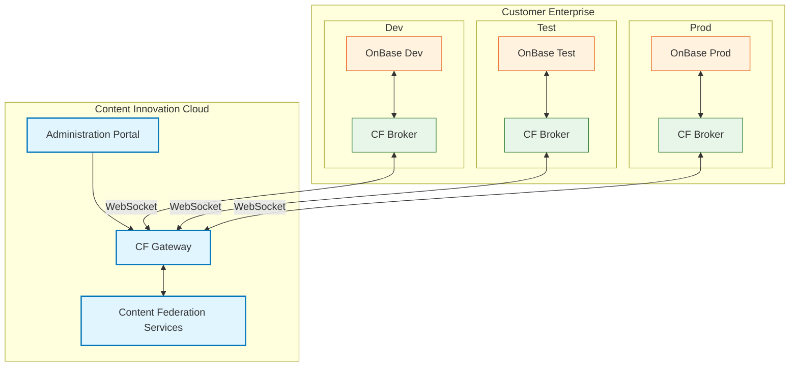

The Content Federation Services (CFS) application is the foundational piece of the Content Innovation Cloud (CIC). CFS connects to a repository, and that connection allows for solutions built in the CIC to access, use, and change data in the customer's content.

The CFS communicates with repositories through the Content Federation (CF) Broker. The CF Broker establishes a secure connection between the content repository and the CF Gateway. Then, administrators are able to control access to the repository content using the Administration Portal.

The CF Broker uses WebSocket technology to connect to the CIC CF Gateway. WebSocket connections are originated from the customer's data center into CIC. WebSocket technology enables bi-directional communication between CIC applications and content repositories in customer data centers without needing to open additional ingress points into the customer’s network.

In the following example, each instance of an OnBase repository within a customer's data center has a CF Broker instance installed to communicate with the CF Gateway. This allows the content in the repository to be accessed from the CIC.

